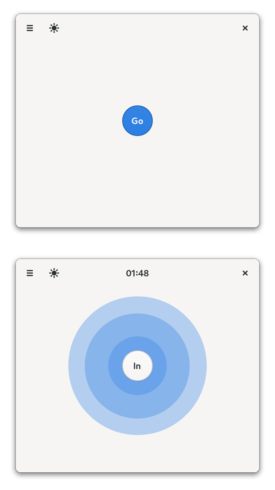

<h1 align="center">
  
  <br>
  Breathing
</h1>

<p align="center">
  <strong>Relax and meditate</strong>
</p>

<p align="center">
  <a href="https://flathub.org/apps/details/io.github.seadve.Breathing">
    
  </a>
  <br>
  <a href="https://www.buymeacoffee.com/seadve">
    
  </a>
</p>

<br>
<p align="center">
  <a href="https://hosted.weblate.org/projects/kooha/breathing/">
    
  </a>
  <a href="https://flathub.org/apps/details/io.github.seadve.Breathing">
    
  </a>
  <a href="https://github.com/SeaDve/Breathing/actions/workflows/testing.yml">
    
  </a>
</p>

<p align="center">
  
</p>

Relax, focus, and become stress-free.

Breathing is a very simple application that guides your breathing pattern. This
pattern is recommended by experts that will help ease your anxiety. It also provides
a calming sound to make it much easier to relax.

The main features of Breathing includes the following:
* 🌬️ Guide your breathing.
* 🌑 Change to a dark-mode with ease.
* 📱 Easy-to-use user interface.
* ⌨️ User-friendly keyboard shortcuts.

## 🏗️ Building from source

### GNOME Builder
GNOME Builder is the environment used for developing this application. It can use Flatpak manifests to create a consistent building and running environment cross-distro. Thus, it is highly recommended you use it.

1. Download [GNOME Builder](https://flathub.org/apps/details/org.gnome.Builder).
2. In Builder, click the "Clone Repository" button at the bottom, using `https://github.com/SeaDve/Breathing.git` as the URL.
3. Click the build button at the top once the project is loaded.

### Meson
```
git clone https://github.com/SeaDve/Breathing.git
cd Breathing
meson _build --prefix=/usr/local
ninja -C _build install
```

## 📦 Third-Party Packages

Unlike Flatpak, take note that these packages are not officially supported by the developer.

### Repology

You can also check out other third-party packages on [Repology](https://repology.org/project/breathing/versions).

## 🙌 Help translate Breathing
You can help Breathing translate into your native language. If you found any typos
or think you can improve a translation, you can use the [Weblate](https://hosted.weblate.org/projects/kooha/breathing/) platform.

## ☕ Support me and the project

Breathing is free and will always be for everyone to use. If you like the project and
would like to support it, you may [buy me a coffee](https://www.buymeacoffee.com/seadve).

## 💝 Acknowledgment

A big thank you to all the [contributors](https://github.com/SeaDve/Breathing/graphs/contributors)
and [translators](https://hosted.weblate.org/projects/kooha/breathing/) from Weblate.
